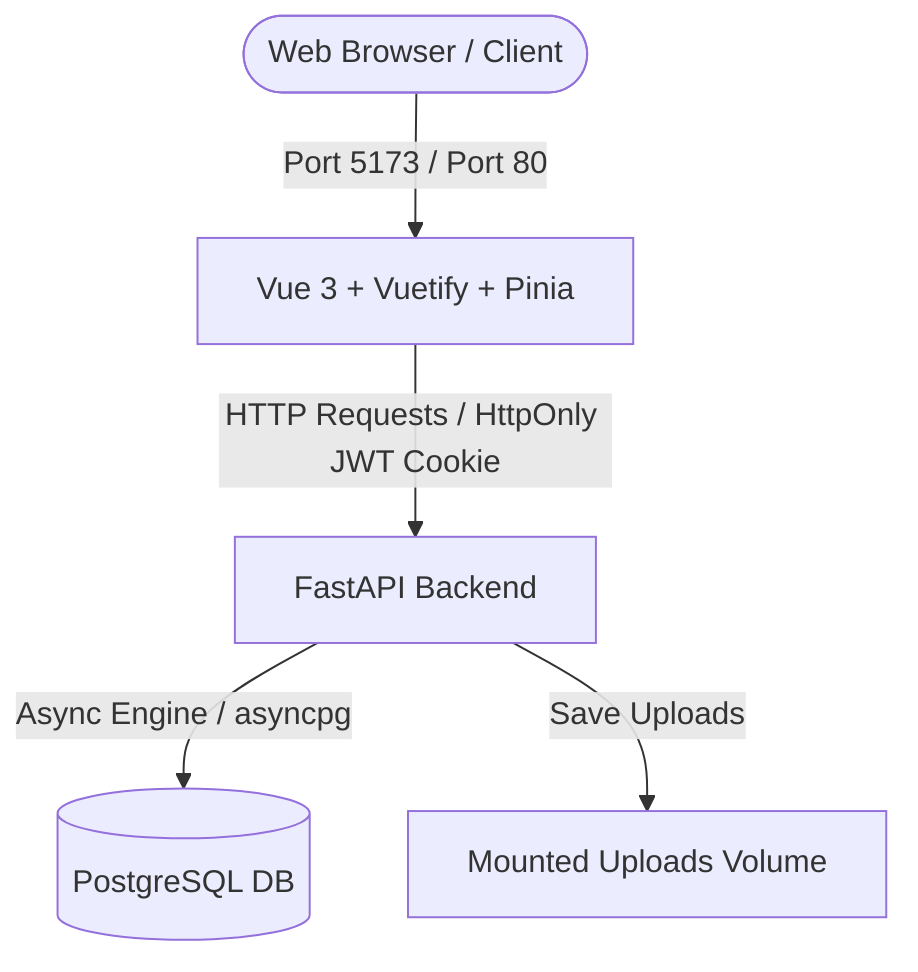

# Kalemera Project

An enterprise-grade, full-stack e-commerce web application featuring a FastAPI backend, a Vite-based Vue 3 + Vuetify frontend, and a PostgreSQL database.

## Architecture & Tech Stack



- **Backend**: Python 3.12, FastAPI, SQLAlchemy 2.0 (Async), Alembic, Pydantic, Passlib, JWT (HttpOnly Cookies), Pillow
- **Frontend**: Vue 3, Vite, Vuetify 3, Pinia, Vue Router 4, Axios, Chart.js
- **Database**: PostgreSQL 16
- **Deployment**: Docker, Docker Compose, Nginx (for production)

---

## API Endpoints Table

| Method | Endpoint | Description | Auth Required | Admin Only |
| :--- | :--- | :--- | :--- | :--- |
| **POST** | `/api/auth/register` | Register a new CUSTOMER user | No | No |
| **POST** | `/api/auth/login` | Login user, set HttpOnly JWT cookie | No | No |
| **POST** | `/api/auth/logout` | Logout user, clear JWT cookie | No | No |
| **GET** | `/api/auth/me` | Retrieve current authenticated user | Yes | No |
| **GET** | `/api/products/` | List products with search/category/page | No | No |
| **GET** | `/api/products/{id}` | Get product details | No | No |
| **POST** | `/api/products/` | Create a new product (multipart/form) | Yes | Yes |
| **PUT** | `/api/products/{id}` | Update product details | Yes | Yes |
| **DELETE** | `/api/products/{id}` | Delete a product | Yes | Yes |
| **GET** | `/api/categories/` | List categories | No | No |
| **POST** | `/api/categories/` | Create category | Yes | Yes |
| **PUT** | `/api/categories/{id}` | Update category | Yes | Yes |
| **DELETE** | `/api/categories/{id}`| Delete category | Yes | Yes |
| **POST** | `/api/orders/` | Place a new order (stock checks) | Yes | No |
| **GET** | `/api/orders/` | List orders (customer: own, admin: all) | Yes | No |
| **GET** | `/api/orders/{id}` | Get order details | Yes | No |
| **PUT** | `/api/orders/{id}/status`| Update order status | Yes | Yes |
| **GET** | `/api/notifications/` | List current user's unread notifications | Yes | No |
| **POST** | `/api/notifications/` | Push custom notifications | Yes | Yes |
| **PUT** | `/api/notifications/{id}/read`| Mark notification as read | Yes | No |
| **GET** | `/api/reports/dashboard`| Get total sales and top items stats | Yes | Yes |
| **GET** | `/api/reports/sales` | Get daily sales for line chart | Yes | Yes |

---

## Authentication Flow

1. **Client** calls `POST /api/auth/login`.
2. **Server** validates credentials, signs a JWT token containing `user_id` and `role`, and sends it back in the `Set-Cookie` header with flags `HttpOnly`, `SameSite=Lax`, and `Path=/`.
3. Subsequent HTTP requests automatically carry the cookie. The backend `get_current_user` dependency verifies the token validity and loads user records from the DB.
4. **Client** calls `POST /api/auth/logout` to clear the cookie.

---

## Quick Start (Plain Python, no Docker)

The backend is a standard Python project. Run it locally with zero external
services — it defaults to a SQLite database (`backend/kalemera.db`) and stores
uploads in `backend/uploads`.

```bash
cd backend
python -m venv .venv
.venv\Scripts\activate        # Windows      (Linux/macOS: source .venv/bin/activate)
pip install -r requirements.txt

# Create the database schema
alembic upgrade head

# Seed categories, products and demo users
python app/seed.py

# Run the API (or simply: python -m app)
python run.py
```

Then open:

- API docs (Swagger): `http://localhost:8000/docs`
- Health check: `http://localhost:8000/api/health`

Demo accounts (from seeding):

| Role | Email | Password |
| --- | --- | --- |
| Admin | `admin@kalemera.com` | `admin123` |
| Customer | `customer@kalemera.com` | `customer123` |

To use PostgreSQL instead of SQLite, set `DATABASE_URL` in `.env` (see
`.env.example`).

### Running Backend Tests

```bash
cd backend
pytest
```

---

## Quick Start (Development, Docker Compose)

1. Make sure you have Docker and Docker Desktop running.
2. Clone the repository and navigate into the `kalemera-project` folder.
3. Start the services:
   ```bash
   docker compose up --build
   ```
4. Access the frontend at: `http://localhost:5173`
5. Access the backend Swagger docs at: `http://localhost:8000/docs`

### Database Migrations

Run Alembic migrations:
```bash
docker compose exec backend alembic upgrade head
```

### Seeding Initial Data

We provide a seeding script to pre-populate database categories and products. Run:
```bash
docker compose exec backend python app/seed.py
```

### Running Backend Tests

Run unit tests inside the backend container:
```bash
docker compose exec backend pytest
```

---

## Production Deployment

To deploy in production (serving frontend via Nginx, backend running 4 Uvicorn workers):
```bash
docker compose -f docker-compose.prod.yml up --build -d
```
Access the application on port `80` (e.g. `http://localhost`).

---

## Contributing Guide

1. Format code using standard formatters:
   - Backend: `black .`
   - Frontend: `npm run lint` or `prettier`
2. Ensure all tests pass before making pull requests: `pytest`
3. Write clean commit messages following Conventional Commits guidelines.

## License

This project is licensed under the MIT License - see the LICENSE file for details.
